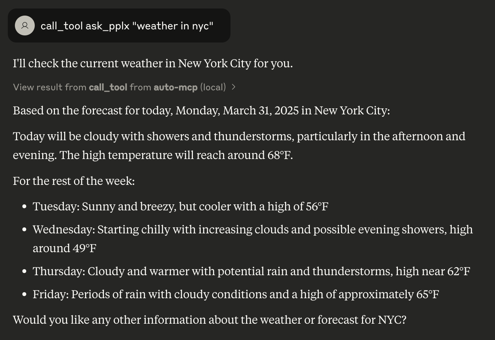

# auto-mcp
Automatically convert functions, tools and agents to MCP servers

## Setup Instructions

### 1. Clone the Repository
```bash
git clone https://github.com/NapthaAI/auto-mcp
```
This command downloads the auto-mcp repository to your local machine.

### 2. Create a Virtual Environment
```bash
uv venv
```
This creates an isolated Python environment using uv, a fast Python package installer and resolver.

### 3. Activate the Virtual Environment
```bash
source .venv/bin/activate
```
### 4. Install Dependencies
```bash
uv pip install -e .
```

### 4. Run the MCP Server
Create New terminal
```bash
export package_path=$PWD
cd examples/crewAI/stock_analysis
uv venv
source .venv/bin/activate
uv pip install -e .
uv pip install -e $package_path
cd /src/stock_analysis
uv --directory $PWD run mcp_run.py
```
This starts the Model Context Protocol (MCP) server using uv to run the mcp_run.py script from the current directory.

## Configuration

To integrate auto-mcp with Claude Desktop, modify the configuration file

```claude_desktop_config.json
{
  "mcpServers": {
    "auto-mcp": {
                "command": "<replace-with-path-to-uv-executable>",
                "args": [
                    "--directory",
                    "<replace-with-path-to-auto-mcp--example-repo>",
                    "run",
                    "mcp_run.py"
                ]
            }
  }
}
```
This configuration tells Claude Desktop how to start the auto-mcp server. Make sure to adjust the paths to match your environment.

## Usage Example

Once the server is running, you can interact with it by using the `call_tool` command:

```
call_tool "Perplexity Agent" "weather in nyc"
```
This example sends a query about the weather in New York City to the Perplexity API through the auto-mcp server.

### Claude Desktop Integration Example

The following image shows the prompt being run in the Claude Desktop Application:



### Debugging
For debugging using the inspector tool
```
npx @modelcontextprotocol/inspector uvx auto-mcp --repository $PWD
```

call_tool financial_agent "what's the current stock price of amazon?"